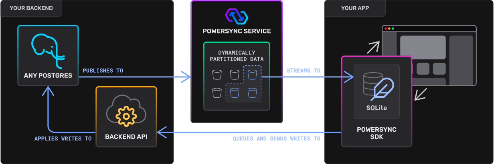

# Powesync - Schedule workshop!

Welcome to the Powersync workshop!

Our goal here is to explore toghether how a schedule would look like when build with a local-first tool.

We have chosen Powersync among others because currently it would be the easier to adopt in an exisiting schedule app.

To get an overview of what Powersync I suggest to take a look at the [overview page](https://docs.powersync.com/overview/readme-1).

This graph is also a good way to get a gist

## What's on the menu

Well, this is a walkthrough more than a workshop.

I've numbered the directories to give you a path to follow on watching files.

First jump to the [init scripts](./1_init-scripts/setup.sql) to see how the DB is structured.

Then jump directly into the [schedule app](./2_schedule-app/src/1_AppSchema.ts).

Then follow the internal numeration.

Following we are going to take a quick peek on the [data API](./3_schedule-backend/1_data.js) and on the [sync rules](./4_powersync-config/sync_rules.yaml)

To finish we have a [post-walkthrough exercise](./5_EXERCISE.md) that will let you have an hands-on experience with the concepts we've seen during the walkthrough.

## Running

The `.env` file contains default configuration for the services. Reference this to connect to any services locally.

You must have node and docker already installed.
To start the app you can run `./workshop-up.sh` on the project root.

The frontend can be accessed at `http://localhost:5173` in a browser.

NOTE: there is a `./workshop-sudo-up.sh` command for linux users that require root privileges to run docker.

## Cleanup

The `setup.sql` script only runs on the first initialization of the container. Delete the container and volumes if making changes.
